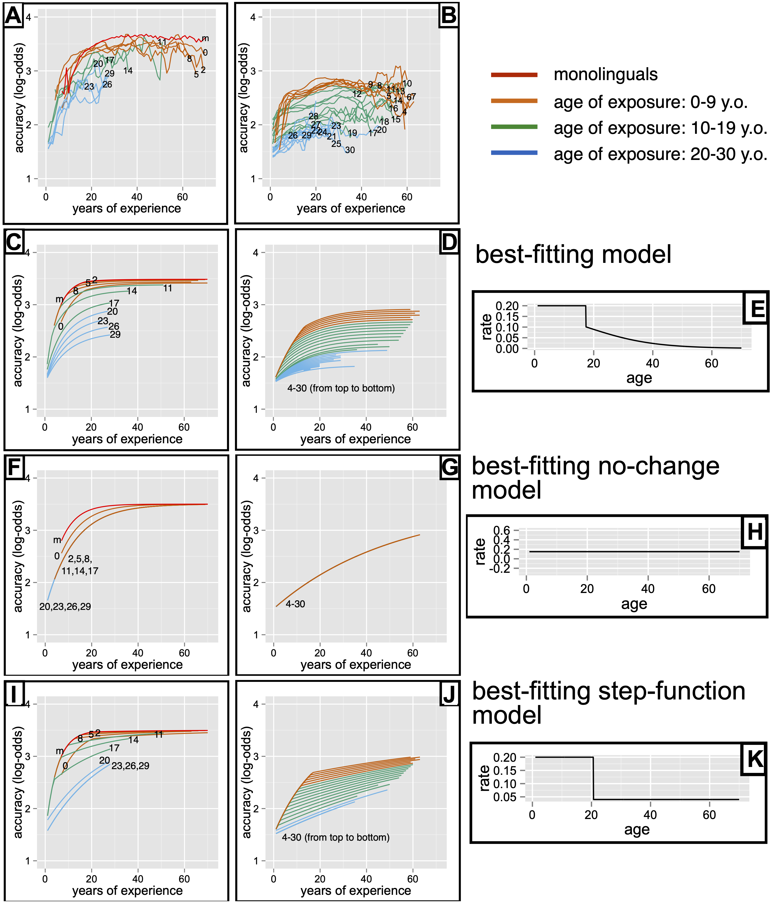

```{r}
# Seed for random number generation
set.seed(42)
knitr::opts_chunk$set(cache.extra = knitr::rand_seed)

#from https://stackoverflow.com/questions/54100806/r-markdown-how-do-i-make-text-float-around-figures
defOut <- knitr::knit_hooks$get("plot")  # save the default plot hook 
knitr::knit_hooks$set(plot = function(x, options) {  # set new plot hook ...
  x <- defOut(x, options)  # first apply the default hook
  if(!is.null(options$wrapfigure)) {  # then, if option wrapfigure is given ...
    # create the new opening string for the wrapfigure environment ...
    wf <- sprintf("\\begin{wrapfigure}{%s}{%g\\textwidth}", options$wrapfigure[[1]], options$wrapfigure[[2]])
    x  <- gsub("\\begin{figure}", wf, x, fixed = T)  # and replace the default one with it.
    x  <- gsub("{figure}", "{wrapfigure}", x, fixed = T)  # also replace the environment ending
  }
  return(x)
})
```

```{r}
options(tinytex.verbose = TRUE)
library("papaja")
library("reshape2")
library("mixtools")
library("tidyverse")
library("broom")
library(tufte) #for nice block quotes
library(patchwork) #for inset figures
```

```{r}
library(dplyr)
library(knitr)
library(kableExtra)
#library(emmeans)
#library(magrittr)
library(doBy)
#library(meta)
library(ggplot2)
```

# Introduction

One hardly needs to conduct an experiment to show that people who begin learning language as an adult rarely if ever reach the same level of proficiency as those who start in early childhood, though plenty of experimental data do exist [@hartshorne2020massive;@flege2019non;@birdsong2018plasticity]. What remains highly controversial is *why*: is poor achievement by later learners due to differences in neural plasticity, motivation, interference from a first language, or something else? These questions have been difficult to resolve because of conflicting results across studies, at least in part because only a handful of studies have the statistical power to produce clear results [@vanhove2013critical;@hartshorne2020massive].

In Hartshorne, Tenenbaum, and Pinker [-@Hartshorne2018] (henceforth HTP), my colleagues and I reported an additional problem: the method typically used to measure critical periods is unable to do so. Specifically, beginning in the 1970s, most studies have used a retrospective "ultimate attainment" method, comparing the linguistic abilities of adults as a function of the age at which they started learning the language in question. Unfortunately, this method turns out to be subject to a number of confounds. Most importantly, very different age-related changes in the ability to learn language can give rise to indistinguishable ultimate attainment curves (Fig. \@ref(fig:FigUA)). 

(ref:UA) Each point on an ultimate attainment curve (**left panels**) is related to an integral under the learning rate curve (**right panels**). While most studies have assumed that it is possible to infer the shape of the theoretically-critical learning rate curves from easier-to-measure ultimate attainment curves, these simulations from HTP show that difficult-to-distinguish ultimate attainment curves can actually be explained by very different learning rate curves (**top** vs. **bottom**). 

```{r FigUA, echo=FALSE, fig.cap="(ref:UA)", out.width="150%", wrapfigure = list("R", .5)}
include_graphics("Figures/FigUA.pdf")
```

The problem is intuitive. Suppose we know that if Agnes leaves her home at 8:15 in the morning, she makes it to work comfortably before 9:00. If she leaves after 8:15, she runs into a traffic jam and arrives much later. Does this mean that the traffic picks up at exactly 8:15? Perhaps. Even a slight decrease in speed, applied over the entire travel distance, could be enough to make her tardy. Alternatively, the traffic may grind to a halt at 8:45, so if Agnes hasn't arrived by then, she is out of luck. The point is that if we know what time she left home and how far she got, we know her *average* speed, but not her speed at any given point along the way.

Similarly, if Bartholomew starts learning Swahili as an adult and manages only 80% the proficiency of a native speaker, this does not mean that he started out learning more slowly than a Swahili-acquiring infant. In fact, during the initial stages of learning, older learners actually learn second languages faster [@snow1978critical;@krashen1979age;@JocelynBUCLD;@snedeker2012disentangling;@ferman2010no;@asher1967learning]. All we know for sure is that at some point along the way, his learning rate decayed to the point where he ultimately was unable to get to the finish line.

Thus, studies of ultimate attainment are simply unable to constrain many of the empirical and theoretical disputes about critical periods, which tend to revolve around the age at which learning ability declines and how rapidly it declines. 

```{r echo=FALSE, include=FALSE, warning=FALSE, results='asis'}
load("data_for_analysis")
print(summary(as.factor(correct$Eng_little)))

correct <- correct %>%
  filter(age <= 70) %>%
  filter(Eng_little != "") %>%
  filter(Eng_start>=4 | Eng_little!="little")
print(summary(as.factor(correct$Eng_little)))

smooth2<-function(tempdata,w,cutoff){
	colnames(tempdata)<-c("age","resp")
	binned<-data.frame(age=c(min(tempdata$age):max(tempdata$age)),N=0,Nr=0,resp=0,SE=0,ymin=0,ymax=0)
	for (a in binned$age){
		binned$N[binned$age==a]<-length(tempdata$age[tempdata$age>(a-w-1) & tempdata$age<(a+w+1)])
		binned$Nr[binned$age==a]<-length(tempdata$age[tempdata$age==a])
		binned$resp[binned$age==a]<-mean(tempdata$resp[tempdata$age>(a-w-1) & tempdata$age<(a+w+1)])
		binned$SE[binned$age==a]<-sd(tempdata$resp[tempdata$age>(a-w-1) & tempdata$age<(a+w+1)])
	}
	binned$SE<-binned$SE/(binned$N^.5)
	binned$ymin<-binned$resp-binned$SE
	binned$ymax<-binned$resp+binned$SE
	#new version of cutoff uses the cutoff to choose continuous ages for which there are at least that many at each age.	
	if (min(binned$N)<cutoff){
		#first, get rid of low values
		t<-binned[1:15,]
		t<-rbind(t,c(0,0,0,0,0,0,0))
		lowa<-max(t$age[t$N<cutoff])		
		t<-binned[binned$age>lowa,]
		t<-rbind(t,c(1000,0,0,0,0,0,0))
		cuta<-(min(t$age[t$N<cutoff]))
		binned<-binned[binned$age<cuta & binned$age>lowa,]
	}
	# binned<-binned[binned$N>cutoff,] #old version. 
	return(binned)
}

#### prep the data.
correct$exp<-correct$age-correct$Eng_start
monos<-cbind(smooth2(correct[correct$Eng_little=="monoeng",c("exp","elogit")],2,10),Eng_start=0)
colnames(monos)[1]<-"exp"
monos$age<-monos$exp+monos$Eng_start
bis<-cbind(smooth2(correct[correct$Eng_little=="bileng",c("exp","elogit")],2,10),Eng_start=0)
colnames(bis)[1]<-"exp"
bis$age<-bis$exp+bis$Eng_start

#non-immersion, year-by-year
for (y in 4:30){
	assign(paste("binned_f",y,sep=""),cbind(smooth2(correct[correct$Eng_little=="little" & correct$Eng_start==y,c("exp","elogit")],2,10),Eng_start=y,Eng_little="little"))
}
nimms<-rbind(binned_f4,binned_f5,binned_f6,binned_f7,binned_f8,binned_f9,binned_f10,binned_f11,binned_f12,binned_f13,binned_f14,binned_f15,binned_f16,binned_f17,binned_f18,binned_f19,binned_f20,binned_f21,binned_f22,binned_f23,binned_f24,binned_f25,binned_f26,binned_f27,binned_f28,binned_f29,binned_f30)
colnames(nimms)[1]<-"exp"
nimms$age<-nimms$exp+nimms$Eng_start


#immersion, 3-year bins
jump<-3
for (y in seq(1,30,jump)){
	assign(paste("binned_i",y,sep=""),cbind(smooth2(correct[correct$Eng_little=="lot" & correct$Eng_start>=y & correct$Eng_start<(y+jump), c("exp","elogit")],2,10),Eng_start=y+(jump-1)/2,Eng_little="lot"))
}
imms1<-rbind(binned_i1,binned_i4,binned_i7)
colnames(imms1)[1]<-"exp"
imms1$age<-imms1$exp+imms1$Eng_start
imms2<-rbind(binned_i10,binned_i13,binned_i16,binned_i19,binned_i22,binned_i25,binned_i28)
colnames(imms2)[1]<-"exp"
imms2$age<-imms2$exp+imms2$Eng_start


monoagg <- monos %>% 
  mutate(y = max(resp)-resp, y1 = 2-y) %>%
  filter(age <= 70)
monofit<-nls(y ~ SSasymp(age, yf, y0, log_alpha), data=monoagg)
monoplot <- ggplot(monoagg, aes(y=y1, x=age)) + geom_point() + 
  geom_line(aes(y = 2 - .fitted, ), lwd=1.25, data=augment(monofit), linetype = "dashed") + theme_bw() + ylab("accuracy (log-odds)") + 
  scale_y_continuous(breaks=(4-3.68 + seq(0, 2.0, .5)), labels=seq(2, 4.0, .5)) + xlim(0,70) + coord_cartesian(ylim=c(0.25, 2))
monofit.rate <- exp(summary(monofit)$coefficients[3,1])

biagg <- bis %>%
  mutate(y = max(resp)-resp, y1 = 2-y) %>%
  filter(age <= 70)

bifit<-nls(y ~ SSasymp(age, yf, y0, log_alpha), data=biagg)
biplot <- ggplot(biagg, aes(y=y1, x=age)) + geom_point() +
  geom_line(aes(y = 2 - .fitted, ), lwd=1.25, data=augment(bifit), linetype = "dashed") + theme_bw() + ylab("accuracy (log-odds)") + 
  scale_y_continuous(breaks=(4-3.68 + seq(0, 2.0, .5)), labels=seq(2, 4.0, .5)) + xlim(0,70) + coord_cartesian(ylim=c(0.25, 2))

laterlearners <- correct[correct$Eng_little=="lot" & correct$Eng_start>=9 & correct$Eng_start<=11,]
lateragg <- laterlearners %>% mutate(years=age - Eng_start) %>% group_by(years) %>% filter(age <= 70) %>%
  summarize(acc = mean(elogit)) %>%
  mutate(y = max(monoagg$resp)-acc, y1 = 2-y)
#laterfit<-nls(y ~ SSasymp(years, yf, y0, log_alpha), data=lateragg)
laterplot<-ggplot(lateragg, aes(y=y1, x=years)) + geom_point() + geom_smooth() + geom_line(aes(x = age, y = 2 - .fitted, ), lwd=1.25, data=augment(monofit), linetype="dashed") + theme_bw() + ylab("accuracy (log-odds)") + 
  scale_y_continuous(breaks=(4-3.68 + seq(0, 2.0, .5)), labels=seq(2, 4.0, .5)) + xlim(0,70) + coord_cartesian(ylim=c(0.25, 2))

r = function(x, r0, tc, alpha, delta){
  if (x<=tc){
    return(r0)
  }else{
    return(r0 * (1 - 1/(1 + exp(-alpha*(x - tc - delta)))))
  }
}

plotr <- function(r0, tc, alpha, delta){
  x = seq(0, 70, .1)
  y = unlist(lapply(x, function(a) {r(a, r0, tc, alpha, delta)}))
  tempdat<-data.frame(x=x, y=y)
  return(ggplot(tempdat, aes(x=x, y=y)) + geom_line(aes(), lwd=1.25) + xlab("age") + ylab("learning rate")+ylim(0,r0+.1))
}

plotr.dat <- function(r0, tc, alpha, delta){
  x = seq(0, 70, .1)
  y = unlist(lapply(x, function(a) {r(a, r0, tc, alpha, delta)}))
  return(data.frame(x=x, y=y))
}

rcurve.nochange <- plotr(.5, 40, 1, 50) + theme(text = element_text(size=30))
rcurve.sigmoid <- plotr(.5, 1, .25, 25) + theme(text = element_text(size=30))
rcurve.sharp <- plotr(.5, 1, 1, 15) + theme(text = element_text(size=30))
rcurve.asymmetric <- plotr(.5, 10, .1, 5) + theme(text = element_text(size=30))

```
# (Disputes about) Recent Progress
(ref:HTP) Figures from HTP, used with permission. Panels show the empirical results (top row), and the best fits for HTP's model (row 2nd from top) and two alternative models (bottom two rows). Monolinguals and immersion learners are plotted in the left panels (*A*, *C*, *F*, & *I*). Non-immersion learners are shown in the middle column (*B*, *D*, *G*, & *J*). In both the left and center columns, data/fits are plotted in terms of years of experience with the language, which makes the contrasts between models easier to see. Finally, panels in the right column show the models' estimated learning rate ($r$) as a function of age.

```{r HTP, echo=FALSE, fig.cap="(ref:HTP)", out.width="100%", out.height="100%"}

```

HTP addressed the limitations reviewed above by analyzing a massive dataset of English syntactic knowledge of 669,498 native and non-native English speakers, including monolinguals, simultaneous bilinguals, and second-language learners who either learned in an English-speaking country ("immersion learners") or not in an English speaking country ("non-immersion learners"). Critically, they used a novel analytic model to disentangle how learning ability changes with age from other factors, including ceiling effects and years of exposure. The results indicated that the rate at which learners acquire English syntax declines substantially at around 17-18 years old, followed by an increasingly gradual decline into old age (Fig. \@ref(fig:HTP)). 

Recently, @van2021critical (henceforth, *SSBH*) have challenged this conclusion, arguing based on a reanalysis of HTP's data that the data are better explained by a model in which learning rate declines continuously from birth. They note certain types of learners (older immigrants and those learning in non-immersion environments) do show a rapid decline in late adolescence, but that this is likely due to schooling effects.

Below, I show that SSBH's analysis suffers from three key defects that vitiate their conclusions. First, their analysis is predicated on a mathematical misunderstanding, rendering it incoherent. Second, even if their analysis was coherent, their own numbers show that it explains the data significantly less well than HTP's, with the exception of a few sub-analyses, where it fits equally well. Finally, even if we ignore statistical significance and take their results at face value, they actually support HTP's conclusions better than their own. Thus, SSBH's analyses either support for HTP's conclusions, or they amount to nothing at all.

Below, I first briefly review HTP's analyses. I then present and discuss SSBH, detailing the three defects mentioned above. Finally, I present a new analysis that addresses some of the limitations in SSBH, thus providing a more effective test of their hypotheses. This, too, fails to support their conclusions, though it does indicate some possible subtleties in HTP's data that could merit further consideration.

## The Hartshorne, Tenenbaum & Pinker (2018) Study (HTP)

As already mentioned, HTP applied a novel analytic model to a large dataset of grammar tests in order to disentangle age-related change in learning rate from other factors. The model works by first assuming that, all else equal, language-learning can be well-described by exponential decay. That is, how much a language learner learns at any given time depends on how much is left to learn. Indeed, we can fit monolingual data quite well by assuming that in each year, monolinguals learn a constant `r round(monofit.rate,2)*100`% of what is left to learn (Fig. \@ref(fig:exponentials), left). That is, they learn 13% in the first year, 11% in the second year [(100% - 13%) * 13%], 10% in the third year [(100% - 13% - (100% - 13%)\*13%) \* 13% ], and so on. This is an asymptotic process and never quite ends, though in this case there is not much progress after about 30 years.

(ref:exponentials) **left**: Performance by monolingual English speakers (N=246,497) on HTP's syntax quiz, aggregated by current age. Solid blue line shows the LOESS smooth, with shaded area showing 95% error bars. Dashed line represents the best-fit exponential decay model. Scale is empirical log-odds (elogit). **right**: Data from same source, but for learners who began at ages 9-11 and learned in an immersion/immigration setting (N=`r dim(laterlearners)[1]`). The dashed line again shows the best-fit exponential decay model *for the monolinguals*. It is clear from the graph that the later learners underperform the monolingual baseline.

```{r exponentials, echo=FALSE,results='asis', fig.cap="(ref:exponentials)", out.width="45%", fig.show="hold"}
monoplot+ggtitle("monolinguals") + theme(text = element_text(size=18))
laterplot+ggtitle("immersion learners who started ages 9-11") + theme(text = element_text(size=18))
```

Later learners do not reach the same level as monolingual learners, so their *average* learning rate must be lower. But, as with Agnes's morning commute, that by itself does not tell us where the bottleneck is. As an example, Fig. \@ref(fig:exponentials) (right) shows results for learners in HTP's study who began at ages 9-11 and learned in an immersion/immigration setting (N=`r dim(laterlearners)[1]`), compared to the exponential model fit for monolinguals. Initially, the later learners progress perhaps even slightly faster than monolinguals, something that has been observed elsewhere [@snow1978critical; @krashen1979age; @JocelynBUCLD; @snedeker2012disentangling]. However, after 15 years, the later learners are noticeably lagging the monolingual pace. Somewhere in between, something changed.

Thus, in order to estimate where this change happens, HTP modified the base exponential model to allow the decay ("learning") rate to change with the learner's biological age. Specifically, they assumed that learning rate is initially flat through some at $t_c$, after which it declines according to a sigmoid:

$$r(t) = \begin{cases} r_0 & t \leq t_c  \\ r_0(1 - \frac{1}{1+e^{-\alpha*(t - t_e - \delta)}}) & t > t_c
	\end{cases}$$

\noindent where $r_0$ is the initial learning rate, $t_e$ is the age of first exposure to English, and $\alpha$ and $\delta$ are parameters governing the shape of the sigmoid.

Sigmoids are mathematically convenient (they have few parameters and are integrable, which was critical for this application), but have one substantial drawback: they are symmetric. Thus, if we would like the sigmoid to only gradually approach zero (reflecting the fact that even very old learners can learn at least a little bit), it must begin declining equally gradually (e.g., Fig. \@ref(fig:sigmoids), far left). By allowing the curve for $r$ to start as a straight line, HTP's model can infer *either* a symmetric decline *or* one where the decline is initially rapid and then slows down (Fig. \@ref(fig:sigmoids), second from left). (@chen2021more present a more elegant formulation that allows for a wider range of asymmetries but nonetheless reaches the same conclusions as HTP; we return to their model below.)

(ref:sigmoids) Examples of learning rate curves that could be inferred by HTP's model.

```{r sigmoids, echo=FALSE, warning=FALSE, results='asis', fig.cap="(ref:sigmoids)", out.width="24%", fig.show="hold"}
rcurve.sigmoid + xlim(0,40)
rcurve.sharp + xlim(0,40)
rcurve.asymmetric + xlim(0,40)
rcurve.nochange + xlim(0,40)
```

Finally, HTP's model allowed for the possibility that bilinguals might learn more slowly than monolinguals for any number of reasons, including having two languages to learn and thus less time to spend on each. Thus, bilinguals were modeled as learning at some percentage of the rate of monolinguals (anywhere from 0% to 100%), with the percentage fit separately for simultaneous bilinguals, immersion learners, and non-immersion learners. HTP named this parameter $E$ for "Experience discount factor," on the intuition that it is capturing differences in the amount of input received by the four different groups. However, in practice it captures any fixed differences in the learning rates between the four groups (that is, differences that do not change with time). 

Despite incorporating a number of simplifications, the model captures key patterns in the data quite well (compare Fig. \@ref(fig:HTP) A&B with C&D). HTP investigated the consequences of critical aspects of the model by comparing to minimal alternatives, including versions that assume no decline in learning rate ($r$) with age or a "step-function" decline (Fig. \@ref(fig:HTP)). The best-fitting "no-change" model fit much less well ($R^2=66$% vs. $R^2=89$%), as did the best-fitting "step-function" model ($R^2$=86%). This is not surprising: these restricted models are special cases of the HTP model, so if they fit well, that is what the HTP model would have found. However, these analyses help illustrate the work done by specific assumptions of the HTP model. For instance, the fact that the "step-function" model assumes learning ability remains constant after the inferred critical age serves to diminish differences among later learners (comp. Fig. \@ref(fig:HTP) I & C).

HTP report a large number of additional results, including follow-up analyses, manipulation checks, and statistical power simulations. For these, we refer the reader to the original manuscript.

# Reanalysis by van der Slik, Schepens, Bongaerts, and van Hout (2021) (SSBH)

```{r echo=FALSE, include=FALSE}
## their curves and my curves
source("learningcurves_models.R")

mina <- 0 #minimum age for graphing
maxa <- 70 #maximum age for graphing

plotTwoGroups <- function(data, vars1, vars2){
  data$elogit1<-0
  for (i in 1:length(data$elogit1)){data$elogit1[i]<-exp.cont(data$age[i],te=data$te[i],E=1,tc=vars1$tc,r0=vars1$r0,alpha=vars1$alpha,d=vars1$d)}
  data$elogit2<-0
  for (i in 1:length(data$elogit2)){data$elogit2[i]<-exp.cont(data$age[i],te=data$te[i],E=1,tc=vars2$tc,r0=vars2$r0,alpha=vars2$alpha,d=vars2$d)}
  return(ggplot(data, aes(x=age, y=elogit1, group=te, fill=te)) + geom_line(aes(), lwd=1.25) + geom_line(aes(y=elogit2, color='red', ), lwd=1.25, linetype="dashed") + theme_bw())
}

rcurve.HTP <- plotr(.2, 17.4, .09, .18)

rcurve.SSBH.immersion.d <- plotr(.15, 15.6, .08, 8.92)
rcurve.SSBH.immersion <- rcurve.SSBH.immersion.d + geom_line(data=plotr.dat(.11, 1, .17, 34.2), aes(x=x, y=y, color='red', ), lwd=1.25, linetype='dashed') + theme_bw()

rcurve.SSBH.nonimmersion.d <- plotr(.06, 18.6, .1, -3.34)
rcurve.SSBH.nonimmersion <- rcurve.SSBH.nonimmersion.d + geom_line(data=plotr.dat(.04, 1, .32, 27.75), aes(x=x, y=y, color='red', ), lwd=1.25, linetype='dashed') + theme_bw()

rcurve.SSBH.monolinguals.d <- plotr(.15, 40, 1, 50)
rcurve.SSBH.monolinguals <- rcurve.SSBH.monolinguals.d + geom_line(data=plotr.dat(.15, 0, 1, 50), aes(x=x, y=y, color='red', ), lwd=1.25, linetype='dashed') + theme_bw()
vars1<-data.frame(tc=40,r0=.15,alpha=1,d=50)
vars2<-data.frame(tc=0,r0=.15,alpha=1,d=50)
#vars3<-data.frame(tc=17.4,r0=.2,alpha=.09,d=.18) HTP's fit results
data<-data.frame(age = seq(mina, maxa, .25), te=0)
acurve.SSBH.monolinguals<-plotTwoGroups(data,vars1,vars2)

rcurve.SSBH.bilinguals.d <- plotr(.1, 38, 1, 0)
rcurve.SSBH.bilinguals <- rcurve.SSBH.bilinguals.d + geom_line(data=plotr.dat(.1, 0, 1, 38.83), aes(x=x, y=y, color='red', ), lwd=1.25, linetype='dashed') + theme_bw()
vars1<-data.frame(tc=38,r0=.1,alpha=1,d=0)
vars2<-data.frame(tc=0,r0=.1,alpha=1,d=38.83)
data<-data.frame(age = seq(mina, maxa, .25), te=0)
acurve.SSBH.bilinguals<-plotTwoGroups(data,vars1,vars2)


rcurve.SSBH.early.d <- plotr(.15, 27.1, .93, -38.98)
rcurve.SSBH.early <- rcurve.SSBH.early.d + geom_line(data=plotr.dat(.15, 1, 1, 26.1), aes(x=x, y=y, color='red', ), lwd=1.25, linetype='dashed') + theme_bw()
vars1<-data.frame(tc=27.1,r0=.15,alpha=.93,d=-38.98)
vars2<-data.frame(tc=1,r0=.15,alpha=1,d=26.1)
data<-rbind(data.frame(age = seq(mina, maxa, .25), te=2),
            data.frame(age = seq(mina, maxa, .25), te=5),
            data.frame(age = seq(mina, maxa, .25), te=8))
data<-data[data$age>=data$te,]
acurve.SSBH.early<-plotTwoGroups(data,vars1,vars2) + 
  geom_text(x=2, y=1.45, label="2") +
  geom_text(x=5, y=1.45, label="5") +
  geom_text(x=8, y=1.45, label="8") 
  
rcurve.SSBH.late.d <- plotr(.12, 19, .08, 10.44)
rcurve.SSBH.late <- rcurve.SSBH.late.d + geom_line(data=plotr.dat(.09, 1, .17, 36.16), aes(x=x, y=y, color='red', ), lwd=1.25, linetype='dashed') + theme_bw()
vars1<-data.frame(tc=19,r0=.12,alpha=.08,d=10.44)
vars2<-data.frame(tc=1,r0=.09,alpha=.17,d=36.16)
data<-rbind(data.frame(age = seq(mina, maxa, .25), te=11),
            data.frame(age = seq(mina, maxa, .25), te=14),
            data.frame(age = seq(mina, maxa, .25), te=17),
            data.frame(age = seq(mina, maxa, .25), te=20),
            data.frame(age = seq(mina, maxa, .25), te=23),
            data.frame(age = seq(mina, maxa, .25), te=26),
            data.frame(age = seq(mina, maxa, .25), te=29))
data<-data[data$age>=data$te,]
acurve.SSBH.late<-plotTwoGroups(data,vars1,vars2) + 
  geom_text(x=11, y=1.45, label="11") +
  geom_text(x=14, y=1.45, label="14") +
  geom_text(x=17, y=1.45, label="17") +
  geom_text(x=20, y=1.45, label="20") +
  geom_text(x=23, y=1.45, label="23") +
  geom_text(x=26, y=1.45, label="26") +
  geom_text(x=29, y=1.45, label="29") 


```

As noted above, @van2021critical (henceforth, *SSBH*) took issue with HTP's analyses and proposed an alternative that, they assert, proves different results. Before continuing, I should address one piece of housekeeping: many of the numbers in SSBH -- and, indeed, most of the factual statements -- are incorrect. In order to keep discussion focused on larger theoretical issues, below I simply correct without commentary any errors in SSBH that do not affect conclusions or theoretical discussion. A full list of errors and corrections can be found in the supplementary appendix. 
 
SSBH report two sets of re-analyses, which they purport show that the rapid decline in learning rate in late adolescence reported by HTP is specific to non-immersion learners and late immersion learners (who began at age 10 or later), whereas monolinguals, simultaneous bilinguals, and early immersion learners are better characterized by a "steady decline" in learning rate. As previewed above, their analyses are mispecified, not significant, and actually support HTP's conclusions to the exclusion of their own. 

## Misspecification of Analysis

```{r echo=FALSE, include=FALSE, warning=FALSE, results='asis'}
#SSE.mono = 0.8914356 #copied from SSBH supporting materials
n.mono = 64 #copied from SSBH supporting materials
k.mono = 3 #copies from SSBH supporting materials
#SSE.bi = 0.382174 #copied from SSBH supporting materials
n.bi = 64  #copied from SSBH supporting materials
k.bi = 3  #corrected from SSBH supporting materials
#SSE.immersion1 = 9.325177 #copied from SSBH supporting materials
n.immersion1 = 181  #copied from SSBH supporting materials
k.immersion1 = 3  #corrected from SSBH supporting materials
#SSE.immersion2 = 3.501753 #copied from SSBH supporting materials
n.immersion2 = 217  #copied from SSBH supporting materials
k.immersion2 = 4  #corrected from SSBH supporting materials
#SSE.nonimmersion = 27.65124 #copied from SSBH supporting materials
n.nonimmersion = 1170  #copied from SSBH supporting materials
k.nonimmersion = 4  #corrected from SSBH supporting materials

n.all = n.mono + n.bi + n.immersion1 + n.immersion2 + n.nonimmersion #numbers from SSBH supporting materials
k.generous = k.mono + k.bi + k.immersion1 + k.immersion2 + k.nonimmersion + 1 #assume they chose the models a priori. add 1 at the end for the group sigma
k.conservative = k.mono+2 + k.bi+2 + k.immersion1+2 + k.immersion2+1 + k.nonimmersion+1+1 #for each subset, first choose whether to have a tc, then fit tc if needed, then add 1 at the end for the group sigma
k.seps = k.mono+1 + k.bi+1 + k.immersion1+1 + k.immersion2+1 + k.nonimmersion+1 + 1
#for each subset, include tc. Add 1 at the end for group sigma.

monos[,c("pred.ELSD","pred.SSBH")] <- NA
bis[,c("pred.ELSD","pred.SSBH")] <- NA
imms1[,c("pred.ELSD","pred.SSBH")] <- NA
imms2[,c("pred.ELSD","pred.SSBH")] <- NA
nimms[,c("pred.ELSD","pred.SSBH")] <- NA

for (i in 1:length(monos$pred.ELSD)){
  monos$pred.ELSD0[i]<-exp.cont(monos$age[i],te=monos$Eng_start[i],E=1,tc=18.0,r0=.19,alpha=.09,d=-.44)
  monos$pred.SSBH0[i]<-exp.cont(monos$age[i],te=monos$Eng_start[i],E=1,tc=1,r0=.16,alpha=.24,d=30.8)
  monos$pred.ELSD[i]<-exp.cont(monos$age[i],te=monos$Eng_start[i],E=1,tc=40.0,r0=.15,alpha=.1,d=50)
  monos$pred.SSBH[i]<-exp.cont(monos$age[i],te=monos$Eng_start[i],E=1,tc=0,r0=.15,alpha=1,d=50)
}
for (i in 1:length(bis$pred.ELSD)){
  bis$pred.ELSD0[i]<-exp.cont(bis$age[i],te=bis$Eng_start[i],E=.63,tc=18.0,r0=.19,alpha=.09,d=-.44)
  bis$pred.SSBH0[i]<-exp.cont(bis$age[i],te=bis$Eng_start[i],E=.7,tc=1,r0=.16,alpha=.24,d=30.8)
  bis$pred.ELSD[i]<-exp.cont(bis$age[i],te=bis$Eng_start[i],E=1,tc=38,r0=.1,alpha=.1,d=0)
  bis$pred.SSBH[i]<-exp.cont(bis$age[i],te=bis$Eng_start[i],E=1,tc=0,r0=.1,alpha=1,d=38.83)
}
for (i in 1:length(imms1$pred.ELSD)){
  imms1$pred.ELSD0[i]<-exp.cont(imms1$age[i],te=imms1$Eng_start[i],E=1,tc=18.0,r0=.19,alpha=.09,d=-.44)
  imms1$pred.SSBH0[i]<-exp.cont(imms1$age[i],te=imms1$Eng_start[i],E=.8,tc=1,r0=.16,alpha=.24,d=30.8)
  imms1$pred.ELSD[i]<-exp.cont(imms1$age[i],te=imms1$Eng_start[i],E=1,tc=27.1,r0=.15,alpha=.93,d=-38.98)
  imms1$pred.SSBH[i]<-exp.cont(imms1$age[i],te=imms1$Eng_start[i],E=1,tc=1,r0=.15,alpha=1,d=26.1)
}
for (i in 1:length(imms2$pred.ELSD)){
  imms2$pred.ELSD0[i]<-exp.cont(imms2$age[i],te=imms2$Eng_start[i],E=1,tc=18.0,r0=.19,alpha=.09,d=-.44)
  imms2$pred.SSBH0[i]<-exp.cont(imms2$age[i],te=imms2$Eng_start[i],E=.8,tc=1,r0=.16,alpha=.24,d=30.8)
  imms2$pred.ELSD[i]<-exp.cont(imms2$age[i],te=imms2$Eng_start[i],E=1,tc=19.0,r0=.12,alpha=.08,d=10.44)
  imms2$pred.SSBH[i]<-exp.cont(imms2$age[i],te=imms2$Eng_start[i],E=1,tc=19,r0=.12,alpha=.08,d=10.44)
}
for (i in 1:length(nimms$pred.ELSD)){
  nimms$pred.ELSD0[i]<-exp.cont(nimms$age[i],te=nimms$Eng_start[i],E=.29,tc=18.0,r0=.19,alpha=.09,d=-.44)
  nimms$pred.SSBH0[i]<-exp.cont(nimms$age[i],te=nimms$Eng_start[i],E=.24,tc=1,r0=.16,alpha=.24,d=30.8)
  nimms$pred.ELSD[i]<-exp.cont(nimms$age[i],te=nimms$Eng_start[i],E=1,tc=18.6,r0=.06,alpha=.10,d=-3.34)
  nimms$pred.SSBH[i]<-exp.cont(nimms$age[i],te=nimms$Eng_start[i],E=1,tc=1,r0=.04,alpha=.32,d=27.75)
}

calcBIC <- function(y, ypred, k){
  sigma <- (sum((y - ypred)^2)/length(y))^.5 #using the MLE. See https://bit.ly/3Ht0kkG. Also note that R's log-likelihood function uses MLE.
  loglik <- sum(log(dnorm(x = y, mean = ypred, sd = sigma))) # thank you https://stats.stackexchange.com/a/73245/53811
  bic <- k*log(length(y))-2*loglik
  return(bic)
}
calcAIC <- function(y, ypred, k){
  sigma <- (sum((y - ypred)^2)/length(y))^.5 #using the MLE. See https://bit.ly/3Ht0kkG. Also note that R's log-likelihood function uses MLE.
  loglik <- sum(log(dnorm(x = y, mean = ypred, sd = sigma))) # thank you https://stats.stackexchange.com/a/73245/53811
  aic <- 2*k-2*loglik
  aicc <- (2*k^2+2*k)/(length(y)-k-1) + aic
  return(aicc)
}

calcLogLik <- function(y, ypred){
  sigma <- (sum((y - ypred)^2)/length(y))^.5 #using the MLE. See https://bit.ly/3Ht0kkG. Also note that R's log-likelihood function uses MLE.
  loglik <- sum(log(dnorm(x = y, mean = ypred, sd = sigma))) # thank you https://stats.stackexchange.com/a/73245/53811
  return(loglik)
}

#calculating Bayes Factor for SSBH Table 1
logBF.full<-(calcBIC(c(monos$resp,bis$resp,imms1$resp,imms2$resp,nimms$resp),
        c(monos$pred.SSBH0,bis$pred.SSBH0,imms1$pred.SSBH0,imms2$pred.SSBH0,nimms$pred.SSBH0),
        7) - 
        calcBIC(c(monos$resp,bis$resp,imms1$resp,imms2$resp,nimms$resp),
        c(monos$pred.ELSD0,bis$pred.ELSD0,imms1$pred.ELSD0,imms2$pred.ELSD0,nimms$pred.ELSD0),
        8))/2

#recalculating relative log-likelihood for SSBH Table 1
logLik.diff<-(calcAIC(c(monos$resp,bis$resp,imms1$resp,imms2$resp,nimms$resp),
        c(monos$pred.SSBH0,bis$pred.SSBH0,imms1$pred.SSBH0,imms2$pred.SSBH0,nimms$pred.SSBH0),
        7) - 
        calcAIC(c(monos$resp,bis$resp,imms1$resp,imms2$resp,nimms$resp),
        c(monos$pred.ELSD0,bis$pred.ELSD0,imms1$pred.ELSD0,imms2$pred.ELSD0,nimms$pred.ELSD0),
        8))/2

monoLL.SSBH<-calcLogLik(monos$resp, monos$pred.SSBH)
monoLL.ELSD<-calcLogLik(monos$resp, monos$pred.ELSD)

biLL.SSBH<-calcLogLik(bis$resp, bis$pred.SSBH)
biLL.ELSD<-calcLogLik(bis$resp, bis$pred.ELSD)

earlyLL.SSBH<-calcLogLik(imms1$resp, imms1$pred.SSBH)
earlyLL.ELSD<-calcLogLik(imms1$resp, imms1$pred.ELSD)


AICDiff.early<-(calcAIC(imms1$resp,
        imms1$pred.ELSD,
        5) - 
calcAIC(imms1$resp,
        imms1$pred.SSBH,
        4))/2

#below, keep in mind that ".SSBH" refers to continuous models, but SSBH don't always adopt the continuous models. So in calculating BIC or AIC for SSBH, we need to use the ELSD predictions for imm2 and nimms
(calcBIC(c(monos$resp,bis$resp,imms1$resp,imms2$resp,nimms$resp),
        c(monos$pred.ELSD0,bis$pred.ELSD0,imms1$pred.ELSD0,imms2$pred.ELSD0,nimms$pred.ELSD0),
        8) - 
calcBIC(c(monos$resp,bis$resp,imms1$resp,imms2$resp,nimms$resp),
        c(monos$pred.SSBH,bis$pred.SSBH,imms1$pred.SSBH,imms2$pred.ELSD,nimms$pred.ELSD),
        k.conservative))/2

AICdiff.seps<-(calcAIC(c(monos$resp,bis$resp,imms1$resp,imms2$resp,nimms$resp),
        c(monos$pred.ELSD0,bis$pred.ELSD0,imms1$pred.ELSD0,imms2$pred.ELSD0,nimms$pred.ELSD0),
        8) - 
calcAIC(c(monos$resp,bis$resp,imms1$resp,imms2$resp,nimms$resp),
        c(monos$pred.ELSD,bis$pred.ELSD,imms1$pred.ELSD,imms2$pred.ELSD,nimms$pred.ELSD),
        k.seps))


(calcBIC(c(monos$resp,bis$resp,imms1$resp,imms2$resp,nimms$resp),
        c(monos$pred.ELSD0,bis$pred.ELSD0,imms1$pred.ELSD0,imms2$pred.ELSD0,nimms$pred.ELSD0),
        8) - 
calcBIC(c(monos$resp,bis$resp,imms1$resp,imms2$resp,nimms$resp),
        c(monos$pred.SSBH,bis$pred.SSBH,imms1$pred.SSBH,imms2$pred.ELSD,nimms$pred.ELSD),
        k.generous))/2

(calcAIC(c(monos$resp,bis$resp,imms1$resp,imms2$resp,nimms$resp),
        c(monos$pred.ELSD0,bis$pred.ELSD0,imms1$pred.ELSD0,imms2$pred.ELSD0,nimms$pred.ELSD0),
        8) - 
calcAIC(c(monos$resp,bis$resp,imms1$resp,imms2$resp,nimms$resp),
        c(monos$pred.SSBH,bis$pred.SSBH,imms1$pred.SSBH,imms2$pred.ELSD,nimms$pred.ELSD),
        k.conservative))/2

(calcAIC(c(monos$resp,bis$resp,imms1$resp,imms2$resp,nimms$resp),
        c(monos$pred.ELSD0,bis$pred.ELSD0,imms1$pred.ELSD0,imms2$pred.ELSD0,nimms$pred.ELSD0),
        8) - 
calcAIC(c(monos$resp,bis$resp,imms1$resp,imms2$resp,nimms$resp),
        c(monos$pred.SSBH,bis$pred.SSBH,imms1$pred.SSBH,imms2$pred.ELSD,nimms$pred.ELSD),
        k.generous))/2

```

SSBH describe their project as reevaluating two claims from HTP: 1) that the decline in learning rate is sharp and begins in adolescence rather than gradual and beginning in early childhood, and; 2) that the decline affects learners independent of major learner-type groupings (monolinguals, immersion learners, etc.).^[This is succinctly highlighted in their abstract: "[HTP's] overall conclusion of one sharply defined critical age at 17.4 for all language learners is based on artificial results. We show that instead of a discontinuous exponential learning with sigmoidal decay (ELSD) model, a continuous ELSD model had a better fit when applied separately to monolinguals, bilinguals, and early immersion learners."] While these are reasonable questions, the analyses they present do not address them. 

### "Discontinuous" vs. "Continuous" Models

SSBH operationalize the first question as a comparison of HTP's model (which they dub "discontinuous") with a "continuous" model. Calling HTP's model "discontinuous" is misleading, since it actually entertains a range continuous and discontinuous possibilities (Fig. \@ref(fig:sigmoids)). In fact, every curve inferrable by SSBH's "continuous" model can also be inferred by HTP's model, since the former is just the latter with $t_c$ fixed at 1 (or sometimes fixed at 0; see appendix). The terminology is doubly misleading because SSBH's "continuous" model can actually infer sharp declines in learning rate; as reviewed above, sigmoids can decline rapidly or slowly, depending on their parameters. Thus, whether the "discontinuous" or "continuous" model should be preferred is largely independent of whether the decline in learning is fast or slow. 

In short, SSBH's analyses actually end up answering a different question from the one they pose. As explained above, the main impact of allowing $t_c$ to be greater than 1 is to allow the decline in learning rate to be asymmetric: starting out fast and then slowing down. As discussed below, SSBH ultimately provide strong evidence for just such an asymmetry.

In short, while SSBH's question about the rate of decline is legitimate, their analyses actually address a different question and shed no light on theirs. This does not mean that SSBH's question cannot be answered. In @chen2021more, we directly investigate the rapidity of the decline in learning using tailored analyses. First, we show that in certain circumstances (not all), HTP's model is in fact biased towards sharp rather than gradual declines. We then introduced a new, more flexible family of curves for the learning rate. Nonetheless, the revised model came to the same conclusion: a rapid decline in learning starting in late adolescence.

### Comparing Age Groups

In order to test whether age-related changes in learning rate differ across different learner groups, SSBH apply the full HTP model and the restricted "continuous" model separately to each of five learner groups: monolinguals, simultaneous bilinguals, non-immersion learners, early immersion learners (started learning ages 1-9) and late immersion learners (started learning age 10+).

While the question is not unreasonable, the analyses are singularly unsuited to address it. The problem is that independent of any effect of age, we expect learners' pace of learning to decline over time as they run out of things to learn. The literature on critical periods is motivated by the fact that learning *also* appears to decline with age, independent of the aforementioned effect of experience (see Fig. \@ref(fig:exponentials), right). Of course, this is only observable precisely by comparing learners who started learning the language at different ages. In a counterfactual world where there were no second-language learners (or late first-language learners), the question of critical periods would probably never have arisen. 

<!-- In short, native language acquisition fully confounds two causes of the diminishing pace of learning: age-related decline in ability and simply running out of things to learn. Because older learners also have less left to learn, it is impossible to determine how much the decline in observed learning is due to age and how much is due to having less to learn. To tease these causes apart, we must deconfound them: for instance, by comparing people who started learning the language at different ages. Indeed, it is the existence of late learners (and their difficulties learning) that spurred research into critical periods for language.  -->

Thus, the goal of both the full HTP model and the "continuous" model is to disentangle the effect of age from the effect of experience. That is, these models ask, "What sort of age-related decline in learning could account for later learners under-performing native speaker norms?" By applying these models to monolinguals alone, SSBH are effectively asking "What sort of age-related decline in learning could account for monolinguals under-performing monolingual norms?"^[As our science progresses, we may eventually be able to independently establish how quickly monolinguals would learn if age was no factor. We could then analyze how monolinguals depart from that standard. Unfortunately, we are not yet in a position to do this.] It should be obvious that no age-related decline is required to explain monolinguals' non-existant under-performance relative to themselves, and indeed that is exactly the result SSBH obtain (see below and also SSBH p. 13).

In this context, it is worth noting that wherever SSBH apply the models to datasets where age and experience are deconfounded (e.g., non-immersion learners), their results are fairly similar to those of HTP. It is only where age and experience are fully confounded (monolinguals, simultaneous bilinguals) or mostly confounded (early immersion learners, all of whom started learning within a narrow range of ages) that they find different results. However, as described in the next two sections, these differences are neither statistically significant nor qualitatively meaningful. 

Again, SSBH's question is not unreasonable, but their analyses cannot shed light on the answer. 

> *HTP defined a continuous learning rate model (see their figure S2, p. 2; S indicates Supplementary Information), but they did not report any outcomes for this model. The occurrence of a discontinuity is a crucial argument in their positive evaluation of the critical period hypothesis. A proper evaluation includes, in our view, comparing the fit of a continuous model with the fit of a discontinuous model.*
> `r tufte::quote_footer('--- SSBH, p. 3')`

<!-- This confusion permeates SSBH's discussion. They argue that native speakers should show minimal age-related decline in learning ability based on data from individuals who have delayed acquisition of their first language [cf. @mayberry2018rethinking]. It is not clear what the one has to do with the other.  -->

#### Lack of Statistical Significance

Because SSBH's "continuous" model is a special case of HTP's model with one fewer free parameter, SSBH compare the best fits of each using Akaike's Information Criterion [AIC; @akaike1974new], which penalizes HTP's model for the extra parameter. That is, since more complex models generally fit the data better, AIC asks whether the the full HTP model improves the fit enough to justify a more complex model (that is, the inclusion of the free parameter $t_c$). Although unremarked by SSBH, in every analysis, HTP's model either does fit significantly better or they fit equally well.

Their first analysis applies the two models to the entire dataset, finding that HTP's model fit the data 10^`r round(logLik.diff/log(10),0)` times better than the "continuous" model, even after the AIC adjustment. Even using Bayesian Information Criterion (BIC), which is more strongly biased against complex models than is AIC  [@wagenmakers2007practical], the full HTP model is 10^`r round(logBF.full/log(10),0)` times more probable than SSBH's "continuous" model.

While this would seem to be strong evidence against their claim that the "continuous" model fits better, SSBH state the the outcome is "inconclusive", because "although mathematically the [full HTP] model appears to the be best, there are logical reasons to prefer the continuous [model]" (pp. 10-11). Specifically, they believe that a sharp drop in learning ability -- as inferred by the full HTP model -- is *a priori* unlikely. This is essentially a Bayesian argument, often glossed as "extraordinary claims require extraordinary evidence." How extraordinary is the evidence here? Following standard Bayesian calculations, even if the "continuous" model was *a priori* a trillion times more likely than the full HTP model, the posterior probability given the data would still favor the full HTP model by a factor of 10^`r round(logBF.full/log(10)-12,0)` to 1. Thus, by any measure, in this contest between empirical data and *a priori* assumptions, the data win this round.

SSBH give a second reason for dispreferring the full HTP model, on the grounds that it doesn't pass a "smell" test. Specifically, they note that it infers a very high initial learning rate for immersion learners -- equivalent to that of monolinguals and greater than that of simultaneous bilinguals -- which they take to be implausible. In fact, this is exactly what we should expect, given that it is well establishedthat the initial learning rate for immersion learners exceeds that of monolinguals [@snow1978critical;@krashen1979age;@JocelynBUCLD;@snedeker2012disentangling;@ferman2010no;@asher1967learning].

Having rejected their first set of analyses, SSBH re-analyze monolinguals, simultaneous bilinguals, immersion learners, and non-immersion learners separately, for the reasons reviewed above. 


Even if one accepts SSBH's reasoning, there is a further problem: their results are not statistically significant. AIC values are not directly interpretable, only their differences are. In every case where SSBH report an analysis that favors their "continuous" model, the difference in AIC is less than 2, less than half the conventional threshold for reaching significance [@burnham1998practical]. For instance, the full HTP model actually fits the monolingual data slightly better than the "continuous" model (log-likelihood = `r round(monoLL.ELSD,1)` vs. `r round(monoLL.SSBH,1)`, respectively), but because the full model has one extra parameter, the AIC analysis slightly prefers the "continuous" model ($AIC_{diff} =$ `r round(2 - (monoLL.ELSD-monoLL.SSBH), 1)`). For the simultaneous bilinguals, the full HTP model fits slightly worse than the "continuous" model both in terms of (log-likelihood = `r round(biLL.ELSD,1)` vs. `r round(biLL.SSBH, 1)` and AIC ($AIC_{diff} =$ `r round(2 - (biLL.ELSD-biLL.SSBH), 1)`), but the difference is again well below the threshold for significance. The final analysis that SSBH claim supports the "continuous" model involves immersion learners who began before the age of 10.  As with monolinguals, the full HTP model actually fits the data a bit better than the "continuous" model (log-likelihood = `r round(earlyLL.ELSD,1)` vs. `r round(earlyLL.SSBH, 1)`, and while the AIC difference is slightly in the direction of the "continuous" model, it does not reach significance ($AIC_{diff} = $ `r round(2 - (earlyLL.ELSD-earlyLL.SSBH), 1)`).

Note that in contrast, every analysis reported by SSBH that supports the full HTP model supports it at essentially ceiling levels. 

#### A Distinction without a Difference


(ref:latechanges) Even large changes in learning rate that happen when the learners are already near ceiling will be very difficult to detect. For example, learning curves for learners who have a constant decay rate of 0.20 (*solid black*) are nearly indistinguishable from learners who have an initial decay rate of 0.19 with a sharp decline at 20 years old.

```{r latechanges, echo=FALSE, warning=FALSE, results='asis', fig.cap="(ref:latechanges)", out.width="35%", fig.show="hold"}
vars2<-data.frame(tc=20,r0=.2,alpha=.1,d=0)
vars1<-data.frame(tc=80,r0=.19,alpha=1,d=50)
#vars3<-data.frame(tc=17.4,r0=.2,alpha=.09,d=.18) HTP's fit results
data<-data.frame(age = seq(mina, maxa, .25), te=0)
plotTwoGroups(data,vars1,vars2) + theme_bw() + ylab("accuracy (log-odds)") + theme(text = element_text(size=20)) + theme(legend.position = "none")
```

Leaving aside whether the analyses make sense or are significant, a further problem for SSBH is that they focus on which model provides a better fit, largely ignoring the fits themselves. In every case where the "continuous" model achieves a slightly better AIC, the fits of the two models are essentially identical. For monolinguals, SSBH note that the full HTP model finds no age-related change in learning at all (Fig. \@ref(fig:natives), top left), while the continuous model finds a decline at around 50 years old (under the optimization parameters used by SSBH, the continuous model -- but not the full HTP model -- *must* have a decline somewhere before the age of 50). However, since under both models learners have essentially reach asymptote by the age of 30, so changes in the learning rate at the age of 50 do not make a detectable difference. Indeed, the model fits for the full HTP model and the continuous model are distinguishable only under *extremely* high magnification(Fig. \@ref(fig:natives), top right; note scale on inset). SSBH's results for simultaneous bilinguals are similar: both models infer essentially the same sharp drop in learning ability in the late 30s. The drop is slightly sharper for the full HTP model (Fig. \@ref(fig:natives), bottom left), but because the drop happens when learners are already near ceiling, this is a distinction with a difference only observable under extremely high magnification (see Fig. \@ref(fig:natives), bottom right, and insert).  The differences between the models for immersion learners who began before the age of 10 as similarly unimpressive (Fig. \@ref(fig:immersion), top right). By contrast, the models do make different predictions for late immersion learners, but as reported by SSBH, these analyses strongly favor the full HTP model (see Fig. \@ref(fig:immersion), bottom.)

To summarize so far, the comparison of the full HTP and "continuous" models is based on a misunderstanding, and in every case either the results strongly support the full HTP model or the two models do not give statistically or substantively different results. 

(ref:immersion) SSBH analyzed early immersion learners (start ages: 1 - 9) (*top*) and late immersion learners (start ages: 10 - 30). *Left panels*: Inferred age-related changes in learning curves. *Right panels*: model fits. *Solid black*: HTP's full HTP model. *Dashed red*: SSBH's "continuous" model.  

```{r immersion, echo=FALSE, warning=FALSE, results='asis', fig.cap="(ref:natives)", out.width="48%", fig.show="hold"}
#early immersion
rcurve.SSBH.early + theme_bw() + ylab("learning rate") + theme(text = element_text(size=20)) + theme(legend.position = "none") + ggtitle("early immersion: learning rates")+ theme(plot.title = element_text(hjust = 0.5), plot.subtitle = element_text(hjust = 0.5)) + ylim(0,.2)

acurve.SSBH.early<-acurve.SSBH.early + theme_bw() + ylab("accuracy (log-odds)") + theme(text = element_text(size=20)) + theme(legend.position = "none") + theme(plot.title = element_text(hjust = 0.5), plot.subtitle = element_text(hjust = 0.5))
inset.early<-acurve.SSBH.early + coord_cartesian(xlim=c(24, 32), ylim=c(3.3, 3.5)) + theme_bw() + ylab("accuracy (log-odds)") + theme(text = element_text(size=15)) + theme(legend.position = "none")

acurve.SSBH.early + ggtitle("early immersion: model fits") + theme(plot.title = element_text(hjust = 0.5), plot.subtitle = element_text(hjust = 0.5)) + theme(text = element_text(size=20)) + inset_element(inset.early, left = .3, bottom = .1, right = .9, top = .8) + theme(legend.position = "none")

#late learners
rcurve.SSBH.late + theme_bw() + ylab("learning rate") + theme(text = element_text(size=20)) + theme(legend.position = "none") + ggtitle("late immersion: learning rates")+ theme(plot.title = element_text(hjust = 0.5), plot.subtitle = element_text(hjust = 0.5)) + ylim(0,.2) + theme(text = element_text(size=20))

#no inset needed for late learners
acurve.SSBH.late<-acurve.SSBH.late + theme_bw() + ylab("accuracy (log-odds)") + theme(text = element_text(size=20)) + theme(legend.position = "none") + theme(text = element_text(size=20))
acurve.SSBH.late + ggtitle("late learners: model fits")+ theme(plot.title = element_text(hjust = 0.5), plot.subtitle = element_text(hjust = 0.5)) + theme(legend.position = "none") + theme(text = element_text(size=20))

```


(ref:natives) SSBH analyzed each learner group separately. Inferred age-related changes in learning curves (*left panels*) and model fits (*right panels*) for monolinguals only (*top panels*) and simultaneous bilinguals only (*bottom panels*). *Solid black*: HTP's HTP model. *Dashed red*: SSBH's continuous model.  

```{r natives, echo=FALSE, warning=FALSE, results='asis', fig.cap="(ref:natives)", out.width="48%", fig.show="hold"}
#monolinguals
rcurve.SSBH.monolinguals + theme_bw() + ylab("learning rate") + theme(text = element_text(size=20)) + theme(legend.position = "none") + ggtitle("monolinguals: learning rates")+ theme(plot.title = element_text(hjust = 0.5), plot.subtitle = element_text(hjust = 0.5))

acurve.SSBH.monolinguals<-acurve.SSBH.monolinguals + theme_bw() + ylab("accuracy (log-odds)") + theme(text = element_text(size=20)) + theme(legend.position = "none")
inset.monolinguals<-acurve.SSBH.monolinguals + coord_cartesian(xlim=c(45, 60), ylim=c(3.495, 3.5)) + theme_bw() + ylab("accuracy (log-odds)") + theme(text = element_text(size=15))+ theme(plot.title = element_text(hjust = 0.5), plot.subtitle = element_text(hjust = 0.5)) + theme(legend.position = "none")

acurve.SSBH.monolinguals + ggtitle("monolinguals: model fits") + theme(plot.title = element_text(hjust = 0.5), plot.subtitle = element_text(hjust = 0.5)) + theme(legend.position = "none") + inset_element(inset.monolinguals, left = .3, bottom = .1, right = .9, top = .8) + theme(legend.position = "none")

#simultaneous bilinguals
rcurve.SSBH.bilinguals + theme_bw() + ylab("learning rate") + theme(text = element_text(size=20)) + theme(legend.position = "none") + ggtitle("simultaneous bilinguals: learning rates")+ theme(plot.title = element_text(hjust = 0.5), plot.subtitle = element_text(hjust = 0.5))

#put together inset
acurve.SSBH.bilinguals<-acurve.SSBH.bilinguals + theme_bw() + ylab("accuracy (log-odds)") + theme(text = element_text(size=20)) + theme(legend.position = "none")
inset<-acurve.SSBH.bilinguals + coord_cartesian(xlim=c(35, 42.5), ylim=c(3.43, 3.46)) + theme_bw() + ylab("accuracy (log-odds)") + theme(text = element_text(size=15)) + theme(legend.position = "none")

acurve.SSBH.bilinguals + ggtitle("simultaneous bilinguals: model fits")+ theme(plot.title = element_text(hjust = 0.5), plot.subtitle = element_text(hjust = 0.5)) + inset_element(inset, left = .3, bottom = .1, right = .9, top = .8) + theme(legend.position = "none")

```

#### Comparing Age-Related Declines
```{r echo=FALSE, include=FALSE, warning=FALSE, results='asis'}
load("NewAnalyses/analyses/fits")

# The piecewise sigmoidal form of the language learning curve
loss_curve_piecewise <- function(r,a1,a2,d1,d2,Eb,Ei,En,te,t,group){
  E <- ifelse(group == "non-immersion",
              En,
              ifelse(group == "immersion",
                     Ei,
                     ifelse(group == "bilinguals",
                            Eb,
                            1)))
  ta <- (a1 * d1 - a2 * d2)/(a1 - a2) # Point of intersection between the two sigmoids
  out <- ifelse(t <= ta,
         -E * r * ((t - te) + (1 / a1) * log((1 + exp(a1 * (te - d1))) / (1 + exp(a1 * (t - d1))))),
         ifelse(te < ta,
                -E * r * ((t - te) + (1 / a1) * log((1 + exp(a1 * (te - d1))) / (1 + exp(a1 * (ta - d1)))) + 
                        (1 / a2) * log((1 + exp(a2 * (ta - d2))) / (1 + exp(a2 * (t - d2))))),
                -E * r * ((t - te) + (1 / a2) * log((1 + exp(a2 * (te - d2))) / (1 + exp(a2 * (t - d2)))))
         )
  )
  return(out)
}


plotTwoGroups.CH<-function(somedat, simdata, pars1, pars2){
  simdata$exp<-simdata$age-simdata$te
  for (i in 1:length(simdata$elogit1)){simdata$elogit1[i]<-(1-exp(loss_curve_piecewise(pars1[1],pars1[2],pars1[3],pars1[4],pars1[5],pars1[6],pars1[7],pars1[8],simdata$te[i],simdata$age[i],simdata$groups[i])))*pars1[9]+pars1[10]}
  for (i in 1:length(simdata$elogit2)){simdata$elogit2[i]<-(1-exp(loss_curve_piecewise(pars2[1],pars2[2],pars2[3],pars2[4],pars2[5],pars2[6],pars2[7],pars2[8],simdata$te[i],simdata$age[i],simdata$groups[i])))*pars2[9]+pars2[10]}
  p <- ggplot(simdata, aes(x=age, y=elogit1, group=te, fill=te)) + 
    geom_line(aes(), lwd=1.25) + 
    geom_line(aes(y=elogit2, color='red', ), lwd=1.25, linetype="dashed") + 
    theme_bw() + 
    geom_smooth(method="loess", data=somedat, aes(y=bability, x=age, group=te, fill=0), alpha=.25) + 
    theme(legend.position = "none")

  calcr = function(pars,t,group){
    r = pars[1]
    a1 = pars[2]
    a2 = pars[3]
    d1 = pars[4]
    d2 = pars[5]
    Eb = pars[6]
    Ei = pars[7]
    En = pars[8]
    E <- ifelse(group == "non-immersion",
                En,
                ifelse(group == "immersion",
                       Ei,
                       ifelse(group == "bilinguals",
                              Eb,
                              1)))
    ta <- (a1 * d1 - a2 * d2)/(a1 - a2) # Point of intersection between the two sigmoids
    out <- ifelse(t <= ta,
                  E * r * (1 - 1/(1 + exp(-1*a1*(t-d1)))),
                  E * r * (1 - 1/(1 + exp(-1*a2*(t-d2))))
            )
    return(out)
  }
  x = seq(0, 70, .1)
  y = unlist(lapply(x, function(a) {calcr(pars1, a, somedat$groups[1])}))
  tempdat<-data.frame(x=x, y=y, y2 = unlist(lapply(x, function(a) {calcr(pars2, a, somedat$groups[1])})))
  r <- ggplot(tempdat, aes(x=x, y=y)) + geom_line(lwd=1.25) + xlab("age") + ylab("learning rate")
  r <- r + geom_line(aes(y=y2, color='red'), lwd=1.25, linetype='dashed') + 
    theme_bw() + ylab("learning rate") + 
    theme(text = element_text(size=20)) + theme(legend.position = "none")
    
  return(list(r,p))
}

#plot monos
data<-data.frame(age = seq(1, 70, .25), te=0, elogit1=0, elogit2=0, groups="monolinguals")
plotTwoGroups.CH(binned.newdat[binned.newdat$groups=="monolinguals",], data, fit_pars_piecewise_classic2, fit_pars_piecewise_monos_classic2) -> res
plotsegs.rcurve.monos<-res[[1]]+ylim(0,.13)
plotsegs.acurve.monos<-res[[2]]+ylim(1.5,3.75)

#plot bis
data<-data.frame(age = seq(1, 70, .25), te=0, elogit1=0, elogit2=0, groups="bilinguals")
plotTwoGroups.CH(binned.newdat[binned.newdat$groups=="bilinguals",], data, fit_pars_piecewise_classic2, fit_pars_piecewise_bis_classic2) -> res
plotsegs.rcurve.bis<-res[[1]]+ylim(0,.13)
plotsegs.acurve.bis<-res[[2]]+ylim(1.5,3.75)

#plot imm1
data<-rbind(data.frame(age = seq(1, 70, .25), te=2, elogit1=0, elogit2=0, groups="immersion"),
            data.frame(age = seq(1, 70, .25), te=5, elogit1=0, elogit2=0, groups="immersion"),
            data.frame(age = seq(1, 70, .25), te=8, elogit1=0, elogit2=0, groups="immersion"))
data<-data[data$age>=data$te,]
plotTwoGroups.CH(binned.newdat[binned.newdat$groups=="immersion" & binned.newdat$te<10,], data, fit_pars_piecewise_classic2, fit_pars_piecewise_imms1_classic2) -> res
plotsegs.rcurve.imms1<-res[[1]]
plotsegs.acurve.imms1<-res[[2]]+ylim(1.5,3.75)

#plot imm2
data<-rbind(data.frame(age = seq(1, 70, .25), te=11, elogit1=0, elogit2=0, groups="immersion"),
            data.frame(age = seq(1, 70, .25), te=14, elogit1=0, elogit2=0, groups="immersion"),
            data.frame(age = seq(1, 70, .25), te=17, elogit1=0, elogit2=0, groups="immersion"),
            data.frame(age = seq(1, 70, .25), te=20, elogit1=0, elogit2=0, groups="immersion"),
            data.frame(age = seq(1, 70, .25), te=23, elogit1=0, elogit2=0, groups="immersion"),
            data.frame(age = seq(1, 70, .25), te=26, elogit1=0, elogit2=0, groups="immersion"),
            data.frame(age = seq(1, 70, .25), te=29, elogit1=0, elogit2=0, groups="immersion"))
data<-data[data$age>=data$te,]
plotTwoGroups.CH(binned.newdat[binned.newdat$groups=="immersion" & binned.newdat$te>9,], data, fit_pars_piecewise_classic2, fit_pars_piecewise_imms2_classic2) -> res
plotsegs.rcurve.imms2<-res[[1]]+ylim(0,.13)
plotsegs.acurve.imms2<-res[[2]]+ylim(.9,3.5)

#plot nimms
data<-rbind(data.frame(age = seq(1, 70, .25), te=4, elogit1=0, elogit2=0, groups="non-immersion"),
            data.frame(age = seq(1, 70, .25), te=8, elogit1=0, elogit2=0, groups="non-immersion"),
            data.frame(age = seq(1, 70, .25), te=12, elogit1=0, elogit2=0, groups="non-immersion"),
            data.frame(age = seq(1, 70, .25), te=16, elogit1=0, elogit2=0, groups="non-immersion"),
            data.frame(age = seq(1, 70, .25), te=20, elogit1=0, elogit2=0, groups="non-immersion"),
            data.frame(age = seq(1, 70, .25), te=24, elogit1=0, elogit2=0, groups="non-immersion"),
            data.frame(age = seq(1, 70, .25), te=28, elogit1=0, elogit2=0, groups="non-immersion"))
data<-data[data$age>=data$te,]
plotTwoGroups.CH(binned.newdat[binned.newdat$groups=="non-immersion" & (binned.newdat$te==4 | binned.newdat$te==8 | binned.newdat$te==12 | binned.newdat$te==16 | binned.newdat$te==20 | binned.newdat$te==24 | binned.newdat$te==28),], data, fit_pars_piecewise_classic2, fit_pars_piecewise_nimms_classic2) -> res
plotsegs.rcurve.nimms<-res[[1]]+ylim(0,.13)
plotsegs.acurve.nimms<-res[[2]]+ylim(.9,3.5)

## the only interestingly different case is monolinguals. Test significance.
monos.revised<-binned.newdat[binned.newdat$groups=="monolinguals",]
  for (i in 1:length(monos.revised$age)){
  monos.revised$pred0[i]<-(1-exp(loss_curve_piecewise(fit_pars_piecewise_classic2[1],fit_pars_piecewise_classic2[2],fit_pars_piecewise_classic2[3],fit_pars_piecewise_classic2[4],fit_pars_piecewise_classic2[5],fit_pars_piecewise_classic2[6],fit_pars_piecewise_classic2[7],fit_pars_piecewise_classic2[8],monos.revised$te[i],monos.revised$age[i],"monolinguals")))*fit_pars_piecewise_classic2[9]+fit_pars_piecewise_classic2[10]
  monos.revised$pred[i]<-(1-exp(loss_curve_piecewise(fit_pars_piecewise_monos_classic2[1],fit_pars_piecewise_monos_classic2[2],fit_pars_piecewise_monos_classic2[3],fit_pars_piecewise_monos_classic2[4],fit_pars_piecewise_monos_classic2[5],fit_pars_piecewise_monos_classic2[6],fit_pars_piecewise_monos_classic2[7],fit_pars_piecewise_monos_classic2[8],monos.revised$te[i],monos.revised$age[i],"monolinguals")))*fit_pars_piecewise_monos_classic2[9]+fit_pars_piecewise_monos_classic2[10]
  }

monos.revised$ll<-log(dnorm(monos.revised$ability, mean=monos.revised$pred, sd=sum((monos.revised$ability - monos.revised$pred)^2)/(length(monos.revised$pred0))^.5))
monos.revised$ll0<-log(dnorm(monos.revised$ability, mean=monos.revised$pred0, sd=sum((monos.revised$ability - monos.revised$pred0)^2)/(length(monos.revised$pred0))^.5))

AICDiff.monos.revised<-(calcAIC(monos.revised$ability,
        monos.revised$pred0,
        6) - 
calcAIC(monos.revised$ability,
        monos.revised$pred,
        6))

```

SSBH do note one other difference across learner groups: the age of onset of age-related decline is much later for monolinguals, simultaneous bilinguals, and early immersion learners than for the other two groups. They do not test whether this result is statistically significant, but it is. We can compare a model that fits each of the five learner groups separately with one that fits all simultaneously, finding that the former substantially outperforms the latter ($AIC_{diff}$ = `r round(AICdiff.seps,0)`; relative log-likelihood: 10^`r round((AICdiff.seps/2)/log(10),0)` to 1).

As already noted, to the extent that the models infer age-related decline for monolinguals, simultaneous bilinguals, or early immersion learners, these declines happen so late as to have minimal effect: all three groups are fit pretty well by exponential decay with a fixed learning rate. SSBH conclude that these three groups are not affected by age, whereas later immersion learners and non-immersion learners are affected by an age-related "change in society and/or educational status" (p. 18). (SSBH do not elaborate on why this change does not affect the other learner groups.)

These conclusions again depend on fallacies and statistical errors. First, while SSBH present these differences across learner groups as a novel observation, they were reported first by HTP. In particular, HTP in fact reported two sets of analyses showing that immersion learners who began before the age of 10 learn at least as rapidly and successfully as simultaneous bilinguals (HTP p. 270). Thus, SSBH merely present a third set of analyses indicating the same pattern. Since HTP also found that exponential decay provides a pretty good fit to native speaker learning curves, it follows that exponential decay also fits early immersion learners. 

Second, HTP show the exact same thing for nonimmersion learners: learners who begin before around the age of 10 are indistinguishable, whereas later learners are slower and less successful. (SSBH do not report any analyses of their own.) Thus, the data actually strongly indicate that immersion and nonimmersion bilinguals are affected similarly by age -- exactly the opposite of what SSBH erroneously conclude. 

Third and finally, SSBH are drawing very strong conclusions from small effects within a model that may not be sufficiently precise As already discussed, the HTP model's method of instantiating asymmetric decline in learning rate can result in overly sharp declines, exemplified by the best HTP fit to the full dataset (Fig. \@ref(fig:HTP)). This will serve to distort model fits. Another distortion comes from the fact that the HTP model requires the modeler to set maximum and minimum value for linguistic knowledge. Both HTP and SSBH used the range [1.5, 3.5] which is only approximately correct. However, as shown in Fig. \@ref(fig:HTP)A&B, the empirical range is a little wider than that. This limits how well the HTP model can actually fit the data (cf. Fig. \@ref(fig:natives), top right).^[Frank [-@frank2018great] has criticized the use of asymptotic models, given that many modern theories (especially construction grammars) posit that the set of grammatical structures is a) unbounded, and b) a moving target due to language change. While I agree in principle, so far in practice nobody has proposed a tractable non-asymptotic model. However, this does not absolve us from setting the asymptotes as precisely as possible.] 

There are other imprecisions in the HTP model, which I return to below. However, the two just mentioned are particularly significant and straightforward to address. Recently, @chen2021more introduced a more flexible model "segmented sigmoid" model that conjoins two sigmoids. This model can easily fit not only the curves fit by HTP (and, by extension, SSBH's "continuous" model), but also smoother asymmetric curves of the types described in the last paragraph. In addition, I rescaled the model to cover the empirical range: [`r round(min(binned.newdat$ability), 1)`, `r round(max(binned.newdat$ability), 1)`]. 

I fit the resulting, more precise model to the extended dataset published by @chen2021more. This dataset is substantially larger, with `r sum(binned.newdat$Nr[binned.newdat$groups=="monolinguals"])` monolinguals, `r sum(binned.newdat$Nr[binned.newdat$groups=="bilinguals"])` simultaenous bilinguals, `r sum(binned.newdat$Nr[binned.newdat$groups=="immersion"])` immersion learners, and `r sum(binned.newdat$Nr[binned.newdat$groups=="non-immersion"])` non-immersion learners. This larger dataset enables more precise measurement of the empirical learning curves, decreasing noise and improving precision of the model fits. 

Fig. \@ref(fig:seps) compares the results of fitting the revised model to all the data simultaneously and to each learner group individually. Above, I explained why I do not believe this is a particularly good test of SSBH's hypothesis, but it is the one they propose. Similarly, in order to evaluate SSBH's hypothesis on the grounds most favorable to it, I follow them in dividing the immersion group into "early" and "late" subgroups, but not the non-immersion group.

For four of the learner groups, fitting to the group individually does not much change the fit, with all models showing a sharp drop in the decay ("learning") rate in late adolescence. The lone exception is monolinguals: fitting to only monolinguals does result in inferring a substantially later decline. While this result is significant ($AIC_{diff}$ = `r round(AICDiff.monos.revised,0)`), the impact on the model fit is again quite subtle. I return to this in the next and final section.

(ref:seps) Comparisons of the revised model trained on all data (solid black lines) and on individual learner groups (dashed red lines), and LOESS-smoothed data (blue lines with shaded 95% confidence intervals). For nonimmersion learners, only a subset of curves are shown. 

```{r seps, echo=FALSE, warning=FALSE, results='asis', fig.cap="(ref:seps)", out.width="40%", fig.show="hold"}
plotsegs.rcurve.monos + ggtitle("monolinguals: learning rates")
plotsegs.acurve.monos + ylab("accuracy (log-odds)") + ggtitle("monolinguals: model fits") + 
    theme(text = element_text(size=20)) + theme(legend.position = "none")

plotsegs.rcurve.bis + ggtitle("simultaneous bilinguals: learning rates")
plotsegs.acurve.bis + ylab("accuracy (log-odds)") + ggtitle("simultaneous bilinguals: model fits") + 
    theme(text = element_text(size=20)) + theme(legend.position = "none")

plotsegs.rcurve.imms1 + ggtitle("early immersion: learning rates")
plotsegs.acurve.imms1 + ylab("accuracy (log-odds)") + ggtitle("early immersion: model fits") + 
    theme(text = element_text(size=20)) + theme(legend.position = "none")

plotsegs.rcurve.imms2 + ggtitle("late immersion: learning rates")
plotsegs.acurve.imms2 + ylab("accuracy (log-odds)") + ggtitle("late immersion: model fits") + 
    theme(text = element_text(size=20)) + theme(legend.position = "none")

plotsegs.rcurve.nimms + ggtitle("late immersion: learning rates")
plotsegs.acurve.nimms + ylab("accuracy (log-odds)") + ggtitle("late immersion: model fits") + 
    theme(text = element_text(size=20)) + theme(legend.position = "none")
```

# Summary and Conclusions

SSBH suggest that HTP's data show that different learner groups show distinct effects of age on learning, with one group largely unaffected (monolinguals, simultaneous bilinguals, early immersion learners) and the other showing a marked decline in adolescence (late immersion learners, non-immersion learners). However, none of their arguments or results hold up under scrutiny. The paper contains dozens of factual misstatements and mathematical miscalculations. Their primary analysis (the comparison of the "discontinuous" and "continuous" models) does not actually test for a discontinuity, and the results are not significant. 

After correcting their errors and improving the precision of their analyses, the results paint a very different picture from the one sketched by SSBH: when analyzed individually, all learner groups exhibit a sharp decline in learning ability in late adolescence, with the lone exception of monolinguals, who showed a somewhat later (but even more dramatic) decline. This difference has to be interpreted with caution: monolinguals are the fastest learners, and so they are least affected by the exact timing of age-related decline. Thus, with respect to SSBH's hypothesis, the best-case scenario is that all learner groups are equally affected by age, with the lone exception of monolinguals, who are, for reasons unknown, blessed. The worst-case scenario is that there are no differences at all.

Even the revised model does not fit the data perfectly. It has no previsions for senescence, which turns out to appear much earlier than had been visible in HTP's data (compare Fig. \@ref(fig:HTP)A with Fig. \@ref(fig:seps), top): around age 35. Unfortunately, our original strategy of simply excluding older subjects will not work: excluding subjects older than 35 would vitiate our ability to study later learners. Similarly, the model cannot entertain age-related *increases* in learning rate, even though these are clear in the present data and in prior work that this occurs in childhood [cf. @snow1978critical]. The models assume learning is asymtotic, whereas Frank [-@frank2018great] correctly notes that many modern theories (especially construction grammars) posit that the set of grammatical structures is a) unbounded, and b) a moving target due to language change.^[I am sympathetic to this point. HTP only adopted asymptotic learning because a) we weren't able to develop anything else that was computationally tractable, and b) exponential decay fit the data pretty well.] The models assume that the differences in learning rate across learner groups (encapsulated by $E$) does not change with age, which is probably unrealistic -- especially if what $E$ is capturing is differences in the quality & quantity of the input.

Nonetheless, modulo two caveats I return to below, the model is not likely to be *very* wrong. The model fits the data so well that there is not much room for another model to fit better. Indeed, many of the imprecisions described above are measurably small: for instance, grammatical knowledge declines between the ages of 35 and 70, but not by much. Indeed, two rounds of model improvement (here and in @chen2021more) have resulted in a clearer picture but not a substantially different picture.

The first caveat is that the model is limited by the data. While a lot of care went into creating HTP's quiz, I doubt that any 95-question quiz can assess an infinitely expressive human grammar precisely and without bias. If such a quiz can be created, we certainly lack the theoretical understanding of syntax needed to construct it at the moment. Moreover, HTP's probes meta-linguistic grammaticality judgments. This is certainly an important linguistic phenomenon -- the spectacular failure of late learners to acquire native-like meta-linguistic knowledge is part of what we wish to explain! -- but it certainly involves cognitive mechanisms not required for other linguistic phenomena, which themselves depend on cognitive mechanisms not needed for meta-linguistic judgment. To the extent this mechanisms are themselves affected by age, the picture will depend on which phenomenon we study.

The second caveat is that our modeling method estimates age-related change in learning rate. It does not assume -- nor can it test -- that this change is due to changes in a single mechanism. It could well reflect the aggregate effects of changes in multiple mechanisms that decline on different schedules.

All of which is to say that HTP and follow-up papers [@chen2021more,@Hernandez2021,@frank2018great,@van2021critical] are just the start of a conversation. We will need many more studies of similar scale and scope to resolve all the open theoretical questions.
<!-- Indeed, the more precise analyses shown in Fig. \@ref(fig:seps) suggest that even monolingual learning (as measured by HTP's quiz) is not perfectly captured by asymptotic exponential decay. One obvious problem is that age-related decline starts much earlier than had been apparent with HTP's smaller dataset (cf. Fig. \@ref(fig:HTP)A). Unfortunately, HTP's strategy of simply excluding subjects old enough to be undergoing age-related decline will not work, since that decline appears to begin by around 35. Using such an early cutoff would severely hamper our ability to measure learning curves for later learners.  -->

<!-- Even if we could use the early cutoff, it would not entirely solve our problem. Fig. \@ref(fig:exponential2) shows an exponential decay curve fit to the empirical data for monolinguals no older than 35, under the assumption that grammatical ability can range from chance on the quiz to 100% correct. As is clear from the figure, the exponential decay curve fits very well. However, it also predicts that newborns should score `r round(exp(1.507901)/(exp(1.507901)+1),2)*100`% correct on HTP's quiz, which seems unlikely. Exponential decay is a good approximation, but it is an approximation. -->

<!-- (ref:exponential2) Best-fitting exponential decay curve for monolinguals 35 years old or younger (*black dashed line*) compared to LOESS-smoothed empirical estimate (*blue line*; grey shading indicates 95% confidence interval). Range of possible scores is set to range from chance to 100% correct on the quiz; in elogit terms, [0, `r round(log(95.5/.5),1)`]. -->

<!-- ```{r exponential2, echo=FALSE, include=FALSE, warning=FALSE, results='asis', out.width="40%"} -->
<!-- #plot monos -->
<!-- # monoagg2<-monoagg[monoagg$age<=35,] -->
<!-- # monoagg2$y<-1-monoagg2$resp/max(monoagg2$resp) -->
<!-- # monoagg2$y2<-1-monoagg2$y -->
<!-- # monofit_short<-nls(y ~ SSasymp(age, yf, y0, log_alpha), data=monoagg2) -->
<!-- # ggplot(monoagg2, aes(y=y2, x=age)) + geom_smooth(color="blue") +  -->
<!-- #   geom_line(aes(y = 1 - .fitted, ), lwd=1.25, data=augment(monofit_short, newdata=data.frame(age=seq(0,35,.01))), linetype = "dashed") + theme_bw() + ylab("accuracy (log-odds)") +  -->
<!-- #   scale_y_continuous(breaks=seq(0, 3.5, .5)/max(monoagg2$resp), labels=seq(0, 3.5, .5)) + xlim(0,35) + coord_cartesian(ylim=c(.25, 1)) -->

<!-- monoagg2<-monoagg[monoagg$age<=35,] -->
<!-- scoremax<-log(95.5/.5) -->
<!-- monoagg2$y<-1-monoagg2$resp/scoremax -->
<!-- monoagg2$y2<-1-monoagg2$y -->
<!-- monofit_short<-nls(y ~ SSasymp(age, yf, y0, log_alpha), data=monoagg2) -->
<!-- ggplot(monoagg2, aes(y=y2, x=age)) + geom_smooth(color="blue") +  -->
<!--   geom_line(aes(y = 1 - .fitted, ), lwd=1.25, data=augment(monofit_short, newdata=data.frame(age=seq(0,35,.01))), linetype = "dotted") + theme_bw() + ylab("accuracy (log-odds)") +  -->
<!--   scale_y_continuous(breaks=seq(0, 3.5, .5)/scoremax, labels=seq(0, 3.5, .5)) + xlim(0,35) + coord_cartesian(ylim=c(.25, .75)) -->

<!-- ``` -->
<!-- (ref:biplot) Performance by simultaneous bilingual English speakers (N=30,417) on HTP's syntax quiz, aggregated by current age. Solid blue line shows the LOESS smooth, with shaded area showing 95% error bars. Dashed line represents the best-fit exponential decay model. Scale is empirical log-odds (elogit). -->

<!-- ```{r biplot, echo=FALSE,results='asis', fig.cap="(ref:biplot)", out.width="45%", fig.show="hold"} -->
<!-- biplot+ggtitle("simultaneous bilinguals") + theme(text = element_text(size=18)) -->
<!-- ``` -->

<!-- This confusion is exemplified in SSBH's repeated statement that a central contribution of HTP was discovering that all four learner groups could be characterized as showing a sharply defined decline in learning ability at 17.4 years.^[Examples: "[HTP's] conclusion appears impressive, for at least five reasons. First, the critical point of 17.4 years that they identified appeared to pertain across all types of language learning: monolingual or bilingual, immersed or instructed, early or late" (p. 2) and  "HTP identified a sharply defined boundary age in grammatical learning and a steady decline thereafter, for all groups of language learners: as astonishing outcome. This outcome is seen as evidence for a critical period for language learning in general" (pp. 15-16).] This has the causality backwards. HTP designed the ELSD model to see how well it could account for differences across language learners in terms of age-related decline plus different initial learning rates for each of the four learner groups (the "experience discount factor", or "$E$"). The ELSD model might have fit quite poorly, but in fact it fit extremely well, which is evidence that the underlying assumptions are at least not very wrong. SSBH's analyses help explicate how the full ELSD model works, but largely do not call it into question.  -->

\clearpage
# References Cited

```{r echo = FALSE, results = 'asis', cache = FALSE}
papaja::render_appendix('appendix.Rmd')
```

